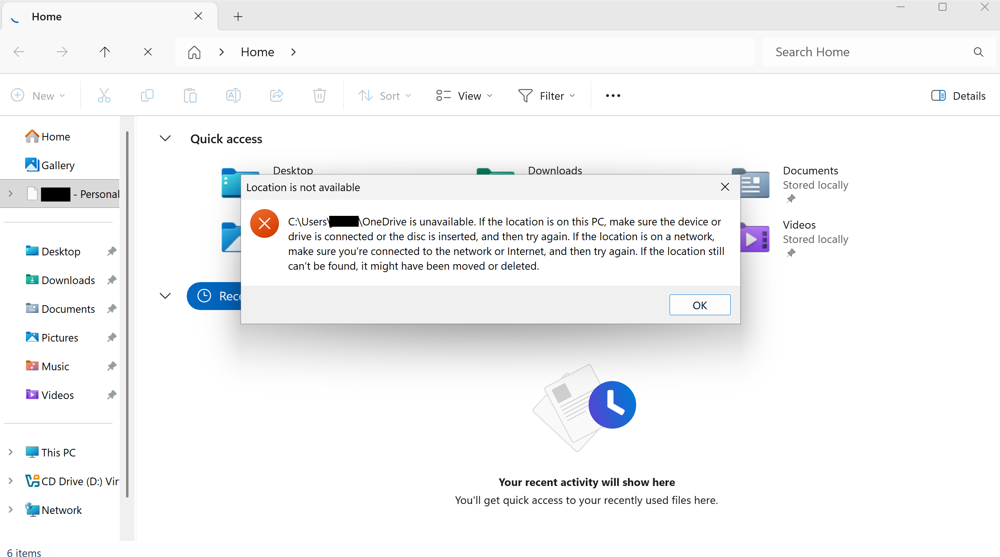

# README

### Table of contents

1. [Introduction](#about-this-repository)
2. [Installation](#install)
3. [FAQ](#frequently-asked-questions)
4. [Issues and Questions](#issues-and-questions)

## About this repository

This program allows you to run one single script and it will instantly remove OneDrive from your system. Additionaly, it will prevent it from being installed in the future, due to updates.

## Install

Simply click 'removeonedrive.bat' in the file explorer on this repository, then click the 'download' icon. Once it has been installed, run it from the directory you installed it to. If it shows a 'Windows Protected your PC' or a 'Windows blocked this file from being downloaded', click 'Keep anyway' or See more then 'Run anyway'

## Frequently Asked Questions

1. If you can still see '[YOUR NAME] - Personal' in the file explorer, and you get an error when you open it, this means the process has worked and you just need to restart your PC.
   

## Issues and Questions

If you have questions, [Start a discussion](https://github.com/manchesterjames-cpu/removeonedrive/discussions), and if you have issues, [Open one here](https://github.com/manchesterjames-cpu/removeonedrive/issues).
