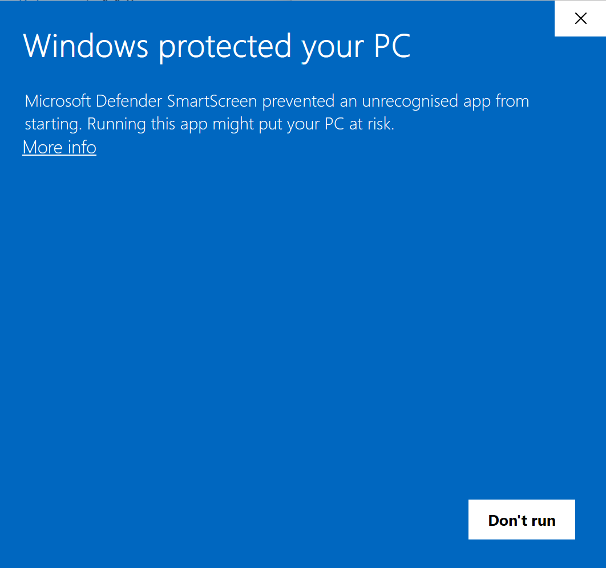
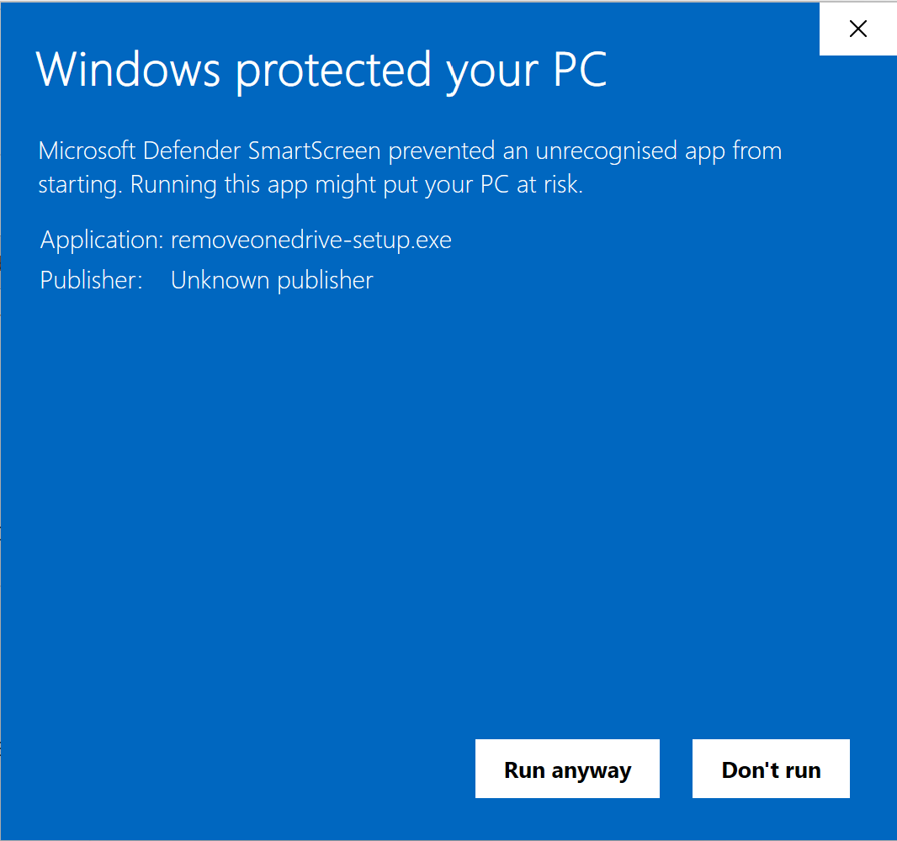
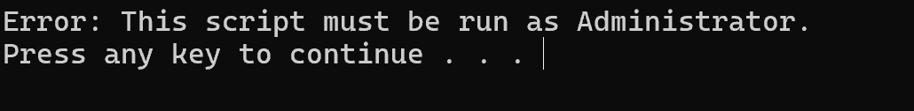

# README

### Table of contents

1. [Introduction](#about-this-repository)
2. [Installation](#install)
3. [FAQ](#frequently-asked-questions)  
   a) [Error when opening app issue FIX](#frequently-asked-questions)
5. [Issues and Questions](#issues-and-questions)

## About this repository

This program allows you to run one single script, and it will instantly remove OneDrive from your system. Additionally, it will prevent it from being installed in the future due to updates.

## Install

Simply navigate to the releases page in this repository, find the setup executable and run it. You may run into a Windows Defender message.  Simply click More info, then run anyway.  Then click 'Yes' on the UAC prompt and follow the installer's instructions. Then, run the .bat file from the location you installed it to. Press any key. A UAC prompt will appear, click Yes, and then press any key again. The script will now remove OneDrive.

## Frequently Asked Questions

1. **Why is there a Windows Security message?**  
   A: Its because apps from GitHub arent usually trusted by Windows (developers on GitHub usually aren't verified publishers)
2. **How do I revert changes?**  
   A: Download the Revert Changes app from [here](https://github.com/jamestheakston1/removeonedrive/raw/refs/heads/main/Revert%20Changes.exe), or find the Revert Changes exe in the path where you installed Remove OneDrive to.
3. **I get an error when I open the app**  

   A: You must right click on the script and click 'Run as Administrator'

## Issues and Questions

If you have questions, [Start a discussion](https://github.com/manchesterjames-cpu/removeonedrive/discussions), and if you have issues, [Open one here](https://github.com/manchesterjames-cpu/removeonedrive/issues).
